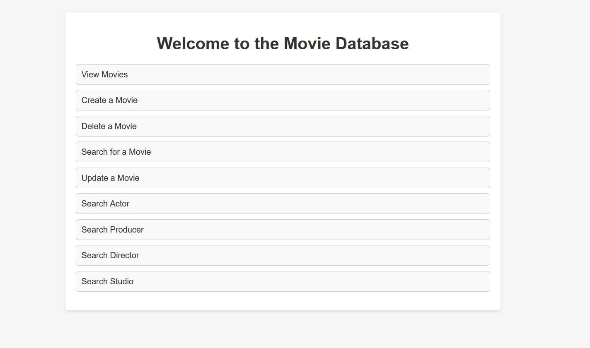

# Movie Database Management: A Flask Web Application

## Introduction
The world of cinema is vast and ever-expanding. With hundreds of thousands of movies produced over the years, managing this enormous collection of information is a challenging task. This project focuses on the development of a web application using Flask, a popular micro web framework in Python, to efficiently manage a movie database. By offering functionalities such as viewing, creating, deleting, and updating movie records, our application serves as a comprehensive tool for movie data management.

## Project Description
Our Flask web application aims to manage a complex movie database comprising various entities such as movies, directors, producers, actors, and movie studios. It hosts a variety of functionalities, meeting the following functional requirements:

1. Movie Information: Each movie record consists of title, year of release, genre, running time, director, producers, actors and actresses, movie studios, and price.

2. Viewing Records: Users can view the entire database, accessing comprehensive information about all the movies.

3. Creating Movies: The application allows users to add new movies to the database.

4. Deleting Movies: Users can delete existing movies from the database.

5. Updating Information: The application provides the capability to search for a specific movie and update its information.

6. Search Functionality: Users can search for movies using various parameters such as title, year of release, genre, director, producers, movie studios, actors and actresses.

7. Extended Search: The application allows users to search for actors, producers, and directors by their names, dates of birth or movies.

8. Studio Search: Users can search movie studios by their names, addresses, or movies.

The back-end database handling these operations is built on MariaDB, providing robustness and efficiency.

## Getting Started

Clone the repository to your local machine:

    git clone https://github.com/AhsanRao/Flask-MovieDatabase

Install the necessary dependencies:

    pip install -r requirements.txt

Run the Flask app (on Windows):

    set FLASK_APP=app.py
    flask run

Run the Flask app (on Unix/Mac):

    export FLASK_APP=app.py
    flask run

## Problem Addressed
In this digital era, managing large amounts of data has become a pressing concern. Traditional methods of data management are time-consuming and error-prone. This project aims to resolve such issues specifically for movie data management. With our application, users can manage a movie database efficiently and perform various operations seamlessly, thus reducing the possibility of human error and significantly saving time.

## Technologies Used

The project leverages several technologies:

- **Python:** The application is entirely written in Python, utilizing its various libraries and frameworks.

- **Flask:** Flask, a micro web framework written in Python, is used to develop the web application. Flask's lightweight and modular design make it a perfect fit for small scale projects like this one.

- **SQLAlchemy:** SQLAlchemy is used for database handling. It provides a full suite of well known enterprise-level persistence patterns, designed for efficient and high-performing database access.

- **HTML & CSS:** The front-end of the application is built using HTML and CSS, providing an intuitive interface for the users.

- **MariaDB:** MariaDB, a fork of MySQL, is used as the database management system. It is robust, scalable, and efficient, making it ideal for managing large datasets.

## Conclusion

The Movie Database Management Flask Web application is a comprehensive tool for managing large movie databases. The application, built using Flask and MariaDB, provides a user-friendly interface that enables users to view, create, delete, and update movie records, making the process of managing a movie database efficient and error-free. The extensive search functionalities offered by the application allow users to search for specific records based on various parameters, making data retrieval quicker and more efficient.

## License

This project is licensed under the MIT License - see the LICENSE file for details.

## Acknowledgements

- Thanks to Flask and SQLAlchemy for making database management easy and efficient.
- Special thanks to the Python community for maintaining such robust libraries and frameworks.
